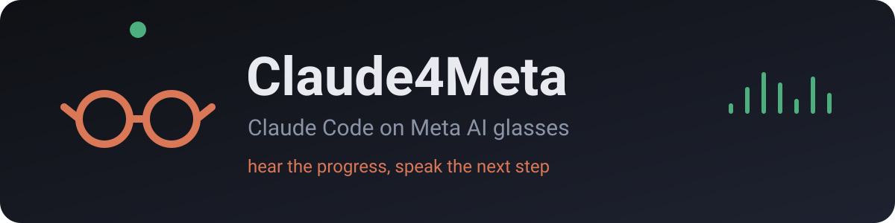
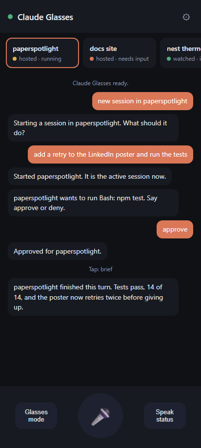
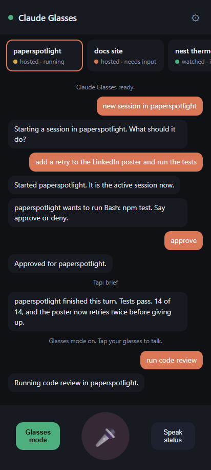
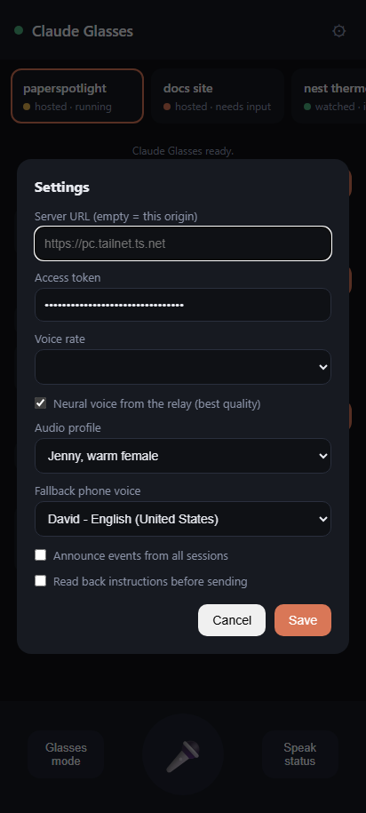

# Claude4Meta 🕶️ — Claude Code on your Meta glasses

<p align="center">
  
</p>

<p align="center">
  
  
  
  
</p>

Your glasses tell you what your coding sessions are doing, in one spoken sentence. You answer with your voice: an instruction, an approval, a slash command, a brand new session. Phone in your pocket, hands on something else, from anywhere you have signal.

Meta glasses do not run apps, so everything rides through the phone. The glasses are Bluetooth audio for a small web app, and the web app talks to a relay on the PC where Claude Code lives.

## Highlights

<table>
  <tr>
    <td align="center" width="33%"><br><sub><b>Sessions and the conversation.</b> Cards for every session, colour-coded by state. Orange bubbles are what you said, dark ones are what the glasses said back.</sub></td>
    <td align="center" width="33%"><br><sub><b>Temple tap, then talk.</b> Glasses mode routes the taps to the app: one tap opens the mic, two speak the brief, three read every session.</sub></td>
    <td align="center" width="33%"><br><sub><b>Your voice, your rules.</b> Pick an audio profile, decide which sessions may interrupt you, and whether instructions get read back before sending.</sub></td>
  </tr>
</table>

- 🔊 **Spoken briefs.** Double tap and hear a two sentence status of the active session. First ask after new activity takes a second or two, then answers come from cache instantly.
- 📣 **Announcements.** The app speaks up on its own when a session finishes, hits an error, or is waiting for you.
- 🎙️ **Voice instructions.** Single tap, speak, done. The words go into the session as a normal message.
- ✅ **Voice approvals.** When a hosted session wants to run a tool that is not pre-approved, the glasses ask. Say approve or deny.
- ⌨️ **Every slash command, by voice.** Whatever the session reports, built-ins and your own skills, is mapped one to one. "Run code review", "run compact", "run model sonnet".
- 🌐 **All your sessions.** Ones you start from the app, ones running in a terminal on the PC, and ones anywhere on your claude.ai account, other machines included.
- 🗣️ **A voice you can live with.** Neural speech through the glasses with selectable profiles, and a graceful fallback to the phone's own voice.

## Install

You need a PC with Node 20 or newer and [Claude Code](https://code.claude.com) installed and logged in. The relay reuses that login, so there is no API key to manage. On the phone side: Android with Chrome, Meta glasses paired as usual, and [Tailscale](https://tailscale.com) on both the PC and the phone.

```powershell
git clone https://github.com/weihaoc168/Claude4Meta.git
cd Claude4Meta
npm install
```

## Quick start

**1. Start the relay.**

```powershell
node server\index.js
```

The first run writes `server\config.json` with a random access token and prints the token and the URLs.

**2. Put HTTPS in front of it.** Chrome only allows the microphone on HTTPS, and Tailscale hands you a valid certificate that works away from home with nothing exposed to the internet.

```powershell
tailscale serve --bg 8787
```

**3. Tell it about your projects** so you can say "new session in ‹name›". Edit `server\config.json`:

```json
{
  "port": 8787,
  "token": "generated on first run",
  "briefModel": "claude-haiku-4-5",
  "ttsVoice": "en-US-JennyNeural",
  "autoAllow": [],
  "projects": [
    { "name": "myapp", "cwd": "C:\\code\\myapp" }
  ]
}
```

**4. Open it on the phone.** Visit the `https://<pc>.<tailnet>.ts.net` URL in Chrome. To skip typing the token, open `https://<your-url>/#token=<token>` once; the app stores it and drops it from the address bar. Then Chrome menu, Add to Home screen.

**5. Tap Glasses mode** and allow the microphone. Re-tap it every time you reopen the app; the browser only hands over the glasses tap controls on a fresh tap. Keep the app in the foreground with the screen on. Glasses mode holds a wake lock for you.

That is it. Say "are you connected" and the glasses will tell you.

## Using it

### Taps

| Tap | Action |
|---|---|
| Single | Open the microphone. Speak, then it sends by itself. |
| Double | Hear the active session brief. |
| Triple | Hear every session. |

### Voice commands

| Say | Effect |
|---|---|
| "status", "session status", "what's the status", "how's it going", "any updates" | Brief of the active session |
| "status all" | Brief of every session |
| "run ‹command›" | Run a slash command in the active session. Say hyphens as spaces: "run code review". Arguments pass through: "run model sonnet". A bare exact command name also works. |
| "list commands" | Speaks the active session's command list |
| "new session in ‹project›" | Starts a hosted session, then asks what it should do |
| "switch to ‹name›" | Changes the active session |
| "approve", "deny" | Answers a pending permission ask |
| "stop" | Interrupts the active session |
| "close session" | Ends the active hosted session and frees its process |
| "are you connected" | Speaks the connection state, including why it is broken |
| "help" | Lists the commands |
| anything else | Sent to the active session as an instruction |

Turn on "Read back instructions before sending" in settings for a yes or no confirmation before each instruction goes out.

## How it fits together

```
Meta glasses  <-- Bluetooth audio -->  Android phone (Chrome PWA)
                                              |
                                        HTTPS over Tailscale
                                              |
                                    PC: relay (Node) + Claude Code
                                              |
                          hosted sessions | this PC's sessions | claude.ai account sessions
```

- **The phone app** (`app/`) is a plain PWA, no build step. Speech recognition captures your voice, neural speech plays through the glasses, and the Media Session API turns temple taps into commands.
- **The relay** (`server/`) is a single Node process with two dependencies. It serves the app, authenticates every call with the token, and streams events to the phone over server-sent events.
- **Three session sources** feed it:

| Type | Where it comes from | What the glasses can do |
|---|---|---|
| hosted | Started from the app by voice, or through the API | Full control: briefs, instructions, approvals, slash commands, interrupt |
| watched | Any session you start in a terminal or editor on the PC | Listen only: briefs and announcements |
| cloud | Any session on your claude.ai account, cloud runs and Remote Control bridges from other machines | Listen only: briefs and announcements |

Hosted sessions run through the Claude Agent SDK, so the relay sees every message and every permission ask. Watched sessions are read from the transcript files under `~/.claude/projects`. Cloud sessions are read from the same claude.ai surface the web and desktop apps use, with your Claude Code login token. That surface is not a public API, so the cloud source fails soft: if it changes, those entries disappear while everything else keeps working.

- **Briefs** are one spoken sentence made by Claude Haiku from recent session activity. The relay calls the API directly with your login token (one to two seconds) and falls back to `claude -p` if that is ever rejected. Briefs are cached per activity digest, generated ahead of time when a session finishes a turn or goes quiet, and their audio is pre-synthesized, so a temple tap usually hits a ready answer.
- **Voice output** comes from Microsoft's neural voices through [`msedge-tts`](https://www.npmjs.com/package/msedge-tts), the voices behind Edge's Read Aloud. Only the short brief text is sent out for synthesis, never code or transcripts. Only non-multilingual voices are offered on purpose: the multilingual ones guess the language from the text and misread short briefs full of project names in French.

## Security

- Every API call needs the access token. The phone stores it locally; the relay compares it in constant time.
- Keep the relay on your tailnet. Do not expose it with Tailscale Funnel or a port forward.
- Hosted sessions ask over the glasses before running tools that are not pre-approved. Local read-only tools (`Read`, `Glob`, `Grep`, todo and subagent plumbing) are auto-allowed. `WebFetch` and `WebSearch` deliberately ask, because an auto-allowed fetch paired with auto-allowed reads would let a prompt-injected session send files off the machine with no ask ever surfacing. Set `"autoAllow": [...]` in the config to your own list if you accept that.
- Unanswered asks are denied after ten minutes.
- Text from sessions and from claude.ai is treated as data. It gets summarized and spoken, never executed.

## Keeping it running

`server\start-relay.ps1` runs the relay in a restart loop and exits if one is already listening. `server\start-relay.vbs` launches that loop with no window. Put a shortcut to the `.vbs` in your Startup folder (`shell:startup`) and the relay comes up at logon and survives crashes.

For an outside check, poll `GET /api/health` with the token from another machine every few minutes and notify yourself when it fails twice in a row. A NAS scheduler with a five line shell script does the job.

## Known limits

These come from Android Chrome, not from the app.

- Speech recognition uses the **phone microphone**, not the glasses microphone. Chrome never engages the Bluetooth voice channel. Keep the phone within about a meter. Replies always play through the glasses.
- The tab must stay in the **foreground with the screen on** for speech in and out. Temple taps still reach the app from the lock screen, but recognition cannot start reliably with the screen off.
- Recognition captures **one utterance per tap**. Continuous mode is unreliable on Android Chrome.

### Getting the glasses microphone

Meta officially supports glasses mic access for third party apps through plain Bluetooth HFP. A native Android app calls `AudioManager.setCommunicationDevice` and records 8 kHz mono audio beamformed to the wearer. No Meta SDK is needed for audio, and sideloading your own app is free through Developer Mode in the Meta AI app. Three ways to build on this relay:

1. **Phone call bridge, hours of work.** A Twilio number saved as a contact. "Hey Meta, call Jarvis" puts call audio on the glasses mic. Twilio ConversationRelay does streaming speech recognition and synthesis and exchanges text with the relay over a WebSocket.
2. **Native companion app, about a week.** A Kotlin foreground service inside a Capacitor wrapper around this same web app. Bluetooth SCO capture streams to the relay, Whisper on the PC transcribes, replies play back through the glasses. Avoid Android's SpeechRecognizer; it ignores Bluetooth routing on Samsung phones.
3. **WhatsApp voice notes, half a day.** A WhatsApp bot number plus "Hey Meta, send a voice message to Jarvis". Not conversational, but zero phone code.

## Documentation

| I want to... | Look at |
|---|---|
| Set it up | [Install](#install) and [Quick start](#quick-start) |
| Learn the taps and phrases | [Using it](#using-it) |
| Understand the moving parts | [How it fits together](#how-it-fits-together) |
| Lock it down | [Security](#security) |
| Keep it alive after reboots | [Keeping it running](#keeping-it-running) |
| Script it | [API](#api) |
| Get true hands-free with the glasses mic | [Getting the glasses microphone](#getting-the-glasses-microphone) |

## API

All endpoints need `X-Auth-Token` (or `?token=` for the event stream).

| Method and path | Purpose |
|---|---|
| `GET /api/health` | Liveness, session count |
| `GET /api/sessions` | Sessions from all sources plus configured projects |
| `POST /api/sessions` `{project or cwd, prompt, name?}` | Start a hosted session |
| `GET /api/sessions/:id/brief` | Short spoken style status |
| `POST /api/sessions/:id/message` `{text}` | Send an instruction or a slash command |
| `POST /api/sessions/:id/permission` `{decision: allow or deny}` | Answer a permission ask |
| `POST /api/sessions/:id/interrupt` | Interrupt the current turn |
| `POST /api/sessions/:id/close` | End a hosted session |
| `GET /api/tts?text=...&voice=...` | Neural speech as MP3 |
| `GET /api/events` | Server-sent events: status, needs_input, done, error, sessions |

## Development

```
app/       the phone PWA: index.html, app.js, manifest, service worker
server/    index.js (HTTP, auth, SSE), hosted-sessions.js (Agent SDK),
           local-agents.js (transcript watcher), cloud-sessions.js (claude.ai),
           summarizer.js (briefs), tts.js (voices), start-relay.ps1 and .vbs
docs/      banner and screenshots
```

No build step and no framework. Edit a file, reload the phone; the service worker is network-first so changes land immediately. The relay only needs a restart when files under `server/` change, and the keep-alive loop does that for you if you kill the process.

## Community

Built for one pair of glasses and one very impatient developer. Issues and pull requests are welcome, especially from anyone who gets the native glasses-microphone path working on a Samsung phone.

Not affiliated with Meta, Anthropic, or Microsoft. The claude.ai session list and the Edge voice service are unofficial surfaces that may change without notice; both are used read-only and fail soft. Use at your own risk on your own account.
